# LAB 10 — Analyse Dynamique d'Applications Android avec Frida

> **Module :** Sécurité des Applications Mobiles
> **Outil principal :** Frida 17.9.1 — Dynamic Instrumentation Toolkit
> **Application cible :** DIVA (Damn Insecure and Vulnerable App) — `jakhar.aseem.diva`
> **Environnement :** Windows 11 + Émulateur Android (AVD API 23 — `emulator-5554`)

---

## 1. Introduction et Objectifs

### Contexte

L'**analyse dynamique** est un pilier de la sécurité mobile. Contrairement à l'analyse statique (lire le code), elle consiste à **observer le comportement réel d'une application pendant son exécution**, sans modifier son code source.

**Frida** est l'outil de référence pour cette discipline. Il permet d'**injecter du code JavaScript** dans n'importe quel processus Android en cours d'exécution, pour :
- Intercepter des appels de fonctions (hooks)
- Observer les données échangées
- Modifier le comportement à la volée

L'application utilisée dans ce lab est **DIVA** (Damn Insecure and Vulnerable App), une application Android intentionnellement vulnérable conçue pour former les professionnels à la sécurité mobile.

### Objectifs Pédagogiques

| # | Objectif | Méthode |
|---|----------|---------|
| 1 | Installer et configurer Frida sur Windows | pip + frida-server |
| 2 | Établir la connexion PC → Émulateur Android | ADB + frida-ps |
| 3 | Valider l'injection de scripts JavaScript | hello.js |
| 4 | Observer les appels réseau natifs | hook_connect.js, hook_network.js |
| 5 | Observer les accès au système de fichiers | hook_file.js |
| 6 | Analyser le stockage Java (SharedPreferences) | hook_prefs_write.js |
| 7 | Analyser les requêtes SQLite | hook_sqlite.js |
| 8 | Détecter les mécanismes de sécurité Java | hook_debug.js, hook_runtime.js |

---

## 2. Architecture Générale du Lab

### Schéma de l'Architecture

```
┌─────────────────────────────────────────────────────────────────┐
│                        MACHINE WINDOWS                          │
│                                                                 │
│  ┌──────────────┐    ┌──────────────┐    ┌──────────────────┐  │
│  │  PowerShell  │───▶│  frida-tools │───▶│  Scripts (.js)   │  │
│  │  (terminal)  │    │  (client)    │    │  hook_*.js       │  │
│  └──────────────┘    └──────┬───────┘    └──────────────────┘  │
│                             │                                   │
│                    ADB (USB/TCP port 5037)                      │
│                             │                                   │
└─────────────────────────────┼───────────────────────────────────┘
                              │
                    ┌─────────▼─────────────────────────────┐
                    │       ÉMULATEUR ANDROID (AVD)          │
                    │         emulator-5554                  │
                    │                                        │
                    │  ┌────────────────────────────────┐   │
                    │  │   frida-server (port 27042)    │   │
                    │  │   /data/local/tmp/frida-server │   │
                    │  └─────────────┬──────────────────┘   │
                    │                │  injecte dans         │
                    │  ┌─────────────▼──────────────────┐   │
                    │  │    jakhar.aseem.diva (DIVA)    │   │
                    │  │    Application cible           │   │
                    │  │                                │   │
                    │  │  ┌──────────┐ ┌────────────┐  │   │
                    │  │  │  Java VM │ │Native(libc)│  │   │
                    │  │  │ (Dalvik) │ │ so/connect │  │   │
                    │  │  └──────────┘ └────────────┘  │   │
                    │  └────────────────────────────────┘   │
                    └───────────────────────────────────────┘
```

### Flux d'Exécution d'un Hook Frida

```
Analyste                  Frida Client              App DIVA
   │                          │                        │
   │── frida -U -f diva ──────▶│                        │
   │         -l hook.js        │                        │
   │                          │── spawn DIVA ──────────▶│
   │                          │                        │ (démarrage)
   │                          │── inject hook.js ──────▶│
   │                          │                        │ hook actif ✓
   │                          │                        │
   │                          │◀── console.log ─────────│ (appel fonction)
   │◀── affiche résultat ──────│                        │
```

---

## 3. Environnement et Outils

### Configuration Technique

| Composant | Valeur |
|-----------|--------|
| Système hôte | Windows 11 |
| Terminal | PowerShell / CMD |
| Python | 3.14 |
| Frida (client) | 17.9.1 |
| Émulateur Android | AVD — Android API 23 (x86_64) |
| ID émulateur | `emulator-5554` |
| Application cible | DIVA — `jakhar.aseem.diva` |
| frida-server | 17.9.1 — android-x86_64 |

### Outils Utilisés

| Outil | Rôle | Commande de vérification |
|-------|------|--------------------------|
| **Python 3** | Environnement d'exécution | `python --version` |
| **pip** | Gestionnaire de paquets Python | `pip --version` |
| **frida** | Bibliothèque d'instrumentation | `frida --version` |
| **frida-tools** | CLI Frida (`frida`, `frida-ps`) | `frida-ps --help` |
| **ADB** | Communication avec l'émulateur | `adb devices` |
| **frida-server** | Composant Android côté serveur | `adb shell ... --version` |
| **VS Code / Notepad** | Édition des scripts `.js` | — |

---

## 4. Étape 1 — Installation du Client Frida

### 1.1 Prérequis Python

Avant d'installer Frida, Python doit être installé et accessible en ligne de commande.

```powershell
python --version
pip --version
```

> **Résultat attendu :** un numéro de version Python ≥ 3.9 et pip fonctionnel.

### 1.2 Installation de frida et frida-tools

```powershell
pip install --upgrade frida frida-tools
```

| Paquet | Rôle |
|--------|------|
| `frida` | Bibliothèque Python principale |
| `frida-tools` | Outils CLI : `frida`, `frida-ps`, `frida-trace` |

### 1.3 Vérification de l'Installation

```powershell
frida --version
frida-ps --help
python -c "import frida; print('frida', frida.__version__)"
```

> **Résultat attendu :** `17.9.1` (ou version installée)

---

## 5. Étape 2 — Installation des Outils Android (ADB)

### Qu'est-ce qu'ADB ?

**ADB** (Android Debug Bridge) est le pont de communication entre le PC et l'émulateur/appareil Android. Sans ADB, Frida ne peut pas communiquer avec l'appareil.

### Installation et Configuration

1. Télécharger les **Platform Tools** depuis [developer.android.com](https://developer.android.com/tools/releases/platform-tools)
2. Ajouter le dossier au `PATH` Windows
3. Activer le **Débogage USB** dans Options développeur de l'émulateur

### Vérification

```powershell
adb version
adb devices
```

**Résultat attendu :**

```
List of devices attached
emulator-5554   device
```

> **Important :** Si l'émulateur apparaît avec le statut `device` (et non `unauthorized`), la connexion est établie correctement.

---

## 6. Étape 3 — Déploiement de frida-server sur Android

### Schéma du Processus de Déploiement

```
GitHub Releases                 PC Windows              Émulateur Android
     │                              │                         │
     │── télécharger ──────────────▶│                         │
     │  frida-server-17.9.1         │── adb push ────────────▶│
     │  -android-x86_64.xz          │  /data/local/tmp/       │
     │                              │                         │
     │                              │── adb shell chmod ─────▶│
     │                              │   755 frida-server      │
     │                              │                         │
     │                              │── adb shell ./frida ───▶│
     │                              │   -server &             │ [running]
     │                              │                         │
     │                              │── frida-ps -U ─────────▶│
     │                              │◀── liste processus ──────│
```

### 3.1 Identifier l'Architecture du CPU

```powershell
adb shell getprop ro.product.cpu.abi
```

| Résultat possible | Architecture |
|-------------------|-------------|
| `x86_64` | Émulateur 64-bit (le plus courant) |
| `arm64-v8a` | Appareil physique récent |
| `x86` | Émulateur 32-bit |
| `armeabi-v7a` | Appareil physique ancien |

> Dans ce lab : architecture **x86_64** (émulateur AVD).

### 3.2 Télécharger frida-server

Télécharger depuis : [github.com/frida/frida/releases](https://github.com/frida/frida/releases)

Fichier à télécharger : `frida-server-17.9.1-android-x86_64.xz`

> Décompresser avec **7-Zip** sous Windows pour obtenir le binaire `frida-server`.

### 3.3 Déployer sur l'Émulateur
<p align="center"> 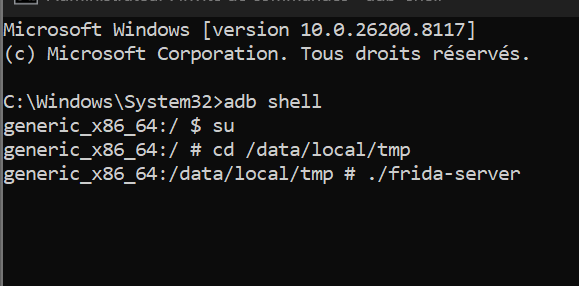 </p>

### 3.4 Vérifier que frida-server est Actif

```powershell
adb shell /data/local/tmp/frida-server --version
```

<p align="center"> 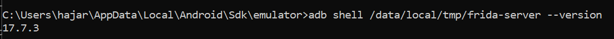 </p>

---

## 7. Étape 4 — Test de Connexion depuis le PC

### 4.1 Lister les Processus Android

```powershell
frida-ps -U
```
<p align="center"> 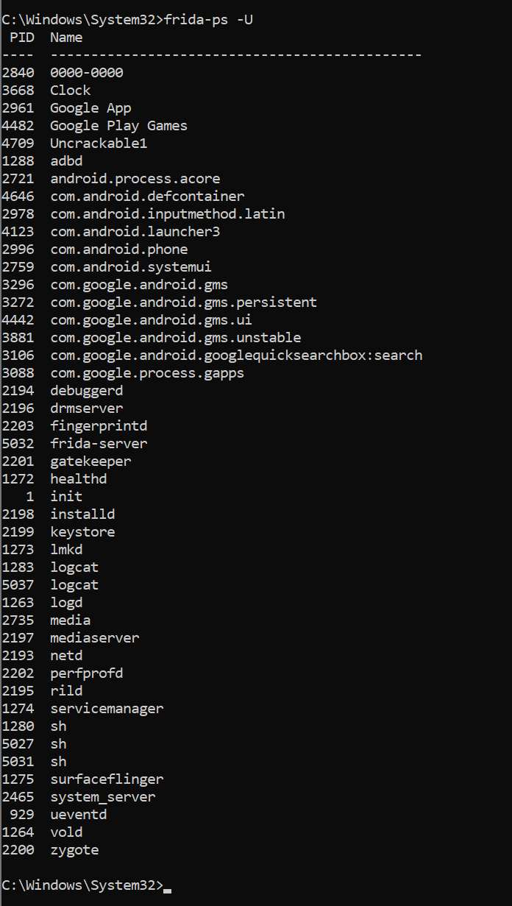 </p>

### 4.2 Vérifier la Présence de DIVA

```powershell
frida-ps -Uai | findstr "diva"
```

**Résultat attendu :**

```
 jakhar.aseem.diva   DIVA
```

> Si DIVA apparaît dans la liste, la connexion Frida est **fonctionnelle** et l'application est **accessible** pour l'injection.


---

## 8. Étape 5 — Injection Minimale pour Valider

L'objectif de cette étape est de **confirmer que Frida peut injecter du code** dans DIVA avant de passer aux scripts complexes.

### 5.1 Test Java — hello.js

Créer le fichier `hello.js` :

```javascript
Java.perform(function () {
  console.log("[+] Frida Java.perform OK");
});
```

Lancer l'injection :

<p align="center"> 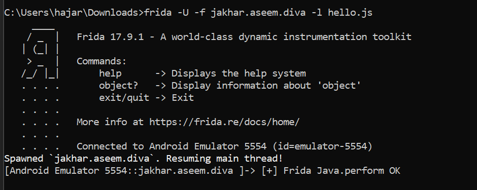 </p>

> **Explication :** `Java.perform()` attend que la machine virtuelle Java soit prête, puis exécute le callback. Le message confirme que Frida a bien accès à la JVM de l'application.

### 5.2 Test Natif — hello_native.js

Créer le fichier `hello_native.js` :

```javascript
console.log("[+] Script chargé");

Interceptor.attach(Module.getExportByName(null, "recv"), {
  onEnter(args) {
    console.log("[+] recv appelée");
  }
});
```

Lancer l'injection :

<p align="center"> 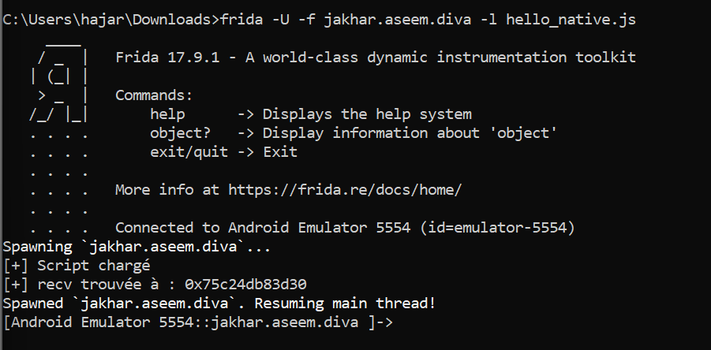 </p>

### Comparaison des Deux Approches

```
┌──────────────────────────────────────────────────────────────┐
│                    DEUX COUCHES D'ANALYSE                    │
├─────────────────────────┬────────────────────────────────────┤
│   COUCHE JAVA (JVM)     │   COUCHE NATIVE (libc.so)          │
├─────────────────────────┼────────────────────────────────────┤
│ Java.perform(...)       │ Interceptor.attach(...)            │
│ Java.use("classe")      │ Process.getModuleByName("libc.so") │
│ .implementation = func  │ .getExportByName("connect")        │
├─────────────────────────┼────────────────────────────────────┤
│ SharedPreferences       │ connect / send / recv              │
│ SQLiteDatabase          │ open / read / write                │
│ android.os.Debug        │ SSL / crypto                       │
└─────────────────────────┴────────────────────────────────────┘
```

---

## 9. Étape 6 — Console Interactive Frida

### Lancement de la Console Interactive

```powershell
frida -U -f jakhar.aseem.diva
```

Dans la console Frida, on peut exécuter du JavaScript **en temps réel**, sans créer de fichier.

### Commandes Exécutées

#### Informations sur le Processus

```javascript
// Identifiant du processus
Process.id

// Plateforme
Process.platform

// Architecture
Process.arch
```
<p align="center"> 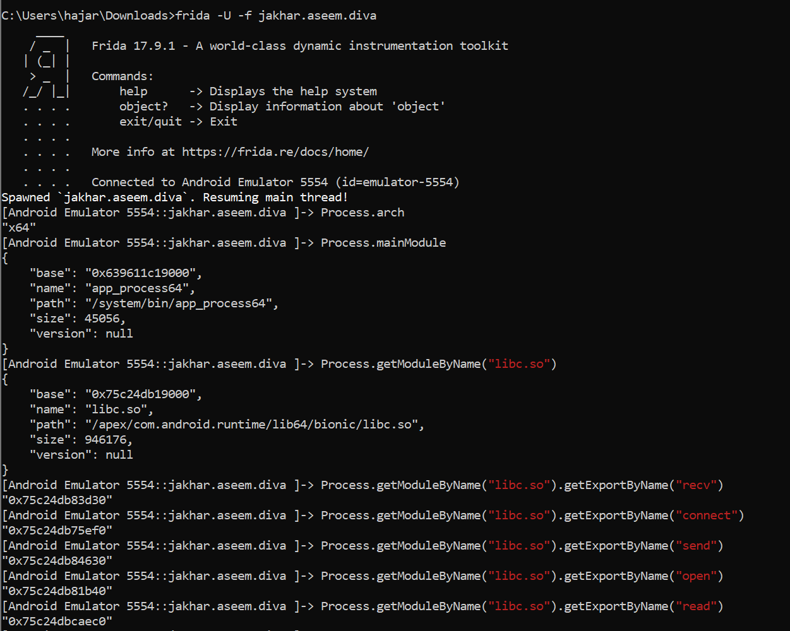 </p>
<p align="center"> 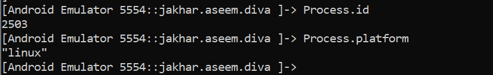 </p>

**Résultats typiques :**

| Commande | Résultat | Signification |
|----------|----------|--------------|
| `Process.id` | `1234` (PID) | Identifiant du processus DIVA |
| `Process.platform` | `"linux"` | Android utilise le noyau Linux |
| `Process.arch` | `"x64"` | Architecture x86_64 de l'émulateur |

#### Vérification de la Disponibilité Java

<p align="center"> 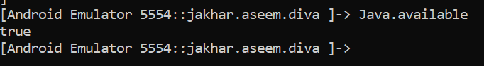 </p>

> **Résultat :** `true` → L'environnement Java est accessible, le hooking de classes Java est possible.

#### Recherche de Bibliothèques Crypto

<p align="center"> 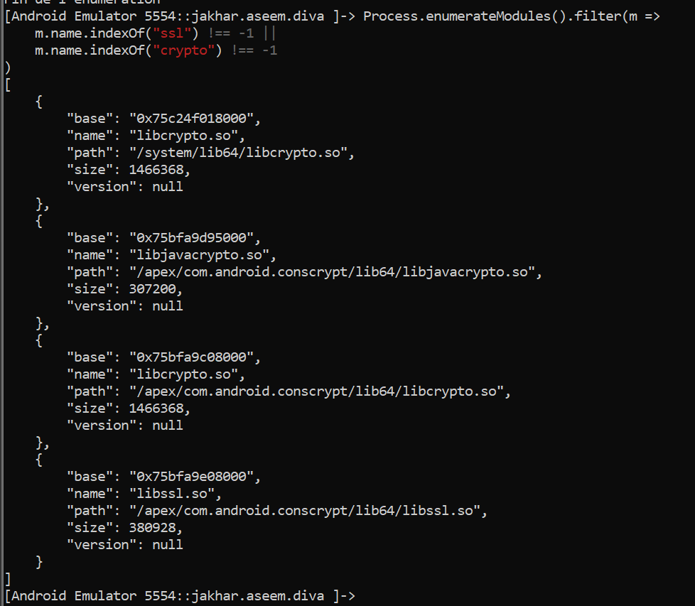 </p>

**Interprétation :** Si des modules contenant `ssl`, `crypto` ou `boring` sont présents, l'application charge des composants liés au chiffrement TLS ou à la cryptographie native.

#### Énumération des Zones Mémoire Exécutables

<p align="center"> 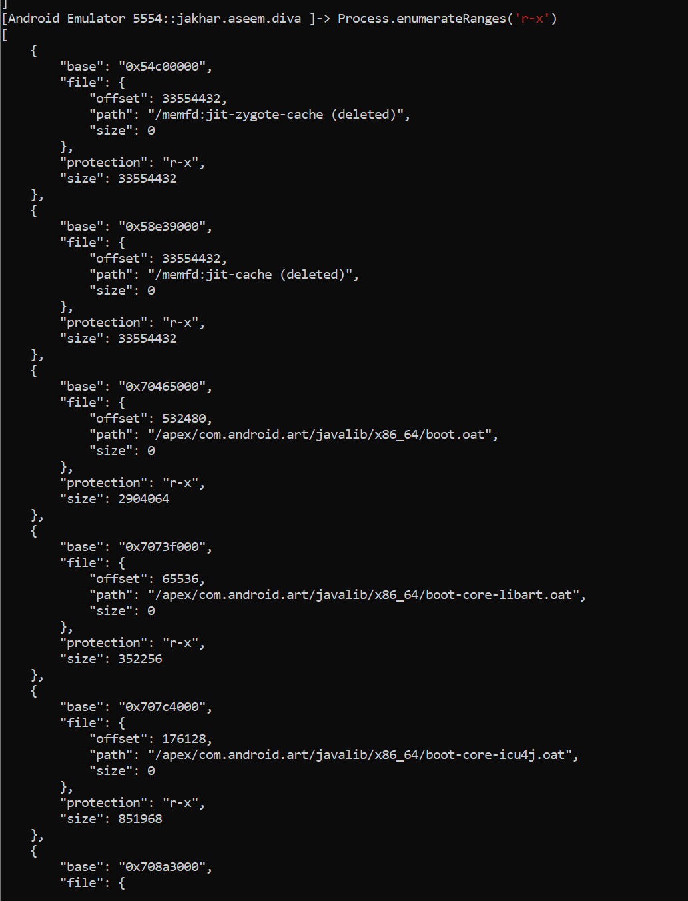 </p>

**Interprétation :** Cette commande liste les régions mémoire avec droits de lecture et d'exécution — zones susceptibles de contenir du code natif.

---

## 10. Étape 7 — Analyse Native : Réseau, Fichiers, Bibliothèques

L'objectif est d'observer le comportement natif de l'application via des hooks sur les fonctions de la bibliothèque `libc.so`.

### Schéma des Hooks Natifs

```
Application DIVA
       │
       ├─── Activité réseau ──────▶ connect() ──▶ hook_connect.js
       │                           send()    ──▶ hook_network.js
       │                           recv()    ──▶ hook_network.js
       │
       ├─── Accès fichiers ──────▶  open()   ──▶ hook_file.js
       │                           read()   ──▶ hook_file.js
       │
       └─── Bibliothèque native ─▶ libc.so
                                   libssl.so
                                   libcrypto.so
```

---

### 7.1 Hook sur connect — Détection des Connexions Réseau

#### Script : `hook_connect.js`

<p align="center"> 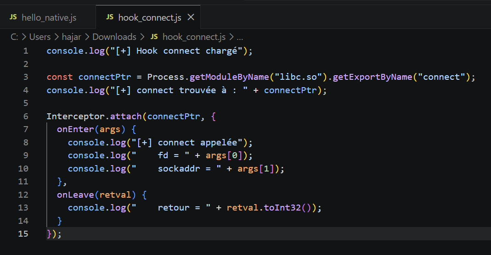 </p>

#### Commande d'Exécution

```powershell
frida -U -f jakhar.aseem.diva -l .\hook_connect.js
```

#### Résultat Obtenu

<p align="center"> 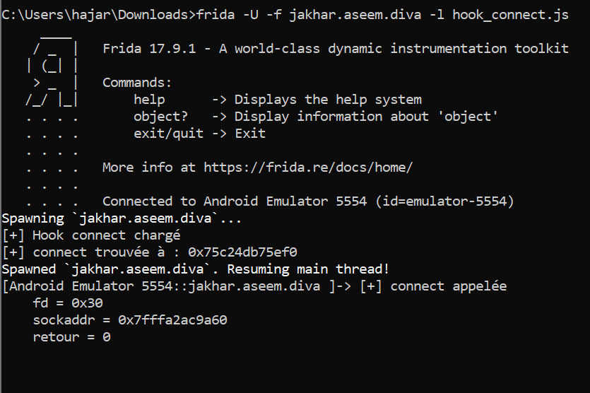 </p>


#### Interprétation Détaillée

| Champ | Valeur | Signification |
|-------|--------|--------------|
| `connect trouvée à` | `0x75c24db75ef0` | Adresse mémoire de `connect()` dans `libc.so` |
| `fd` | `0x30` | File descriptor n°48 — socket réseau ouverte |
| `sockaddr` | `0x7fffa2ac9a60` | Pointeur vers la structure d'adresse destination |
| `retour` | `0` | Connexion réussie (0 = succès en POSIX) |

**Conclusion :** L'application DIVA établit activement des connexions réseau natives. Le hook a réussi à intercepter un appel réel à `connect()` avec une valeur de retour `0`, confirmant que la connexion s'est exécutée correctement.

---

### 7.2 Hook sur send/recv — Observation du Trafic Réseau

#### Script : `hook_network.js`

<p align="center"> 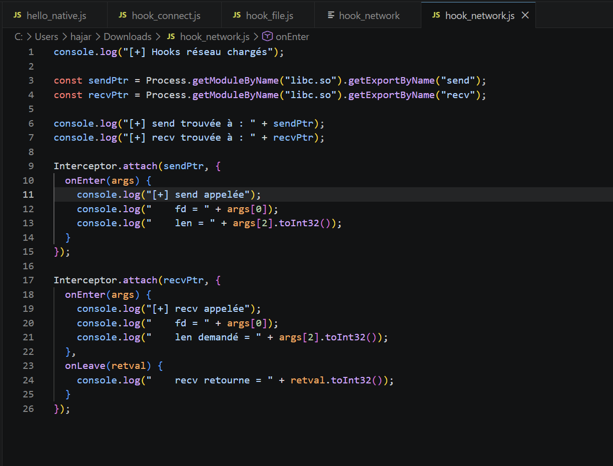 </p>

#### Commande d'Exécution

```powershell
frida -U -f jakhar.aseem.diva -l .\hook_network.js
```

#### Résultat Attendu

<p align="center"> 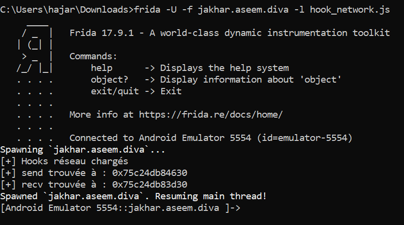 </p>

#### Interprétation

| Observation | Signification |
|-------------|--------------|
| `send appelée` | L'application envoie des données vers un serveur distant |
| `recv appelée` | L'application reçoit des données depuis un serveur |
| `len = 128` | Volume de données envoyées (octets) |
| `recv retourne = 256` | Nombre d'octets réellement reçus |

**Conclusion :** DIVA effectue des échanges réseaux réels. Les fonctions `send()` et `recv()` de `libc.so` sont interceptées pendant les interactions avec l'application.

---

### 7.3 Hook sur open/read — Accès au Système de Fichiers

#### Script : `hook_file.js`
<p align="center"> 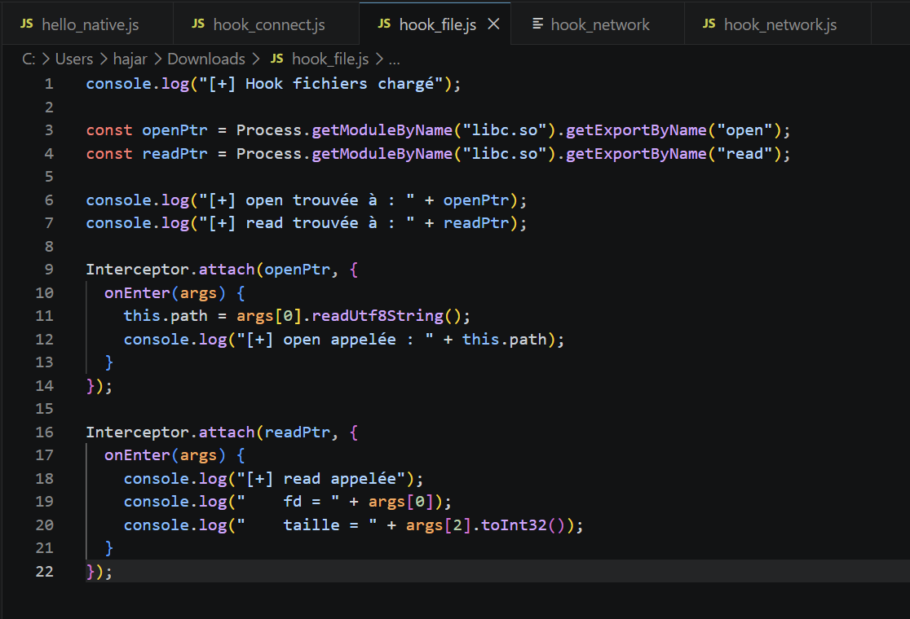 </p>

#### Commande d'Exécution

```powershell
frida -U -f jakhar.aseem.diva -l .\hook_file.js
```

#### Résultat Obtenu (extrait)

<p align="center"> 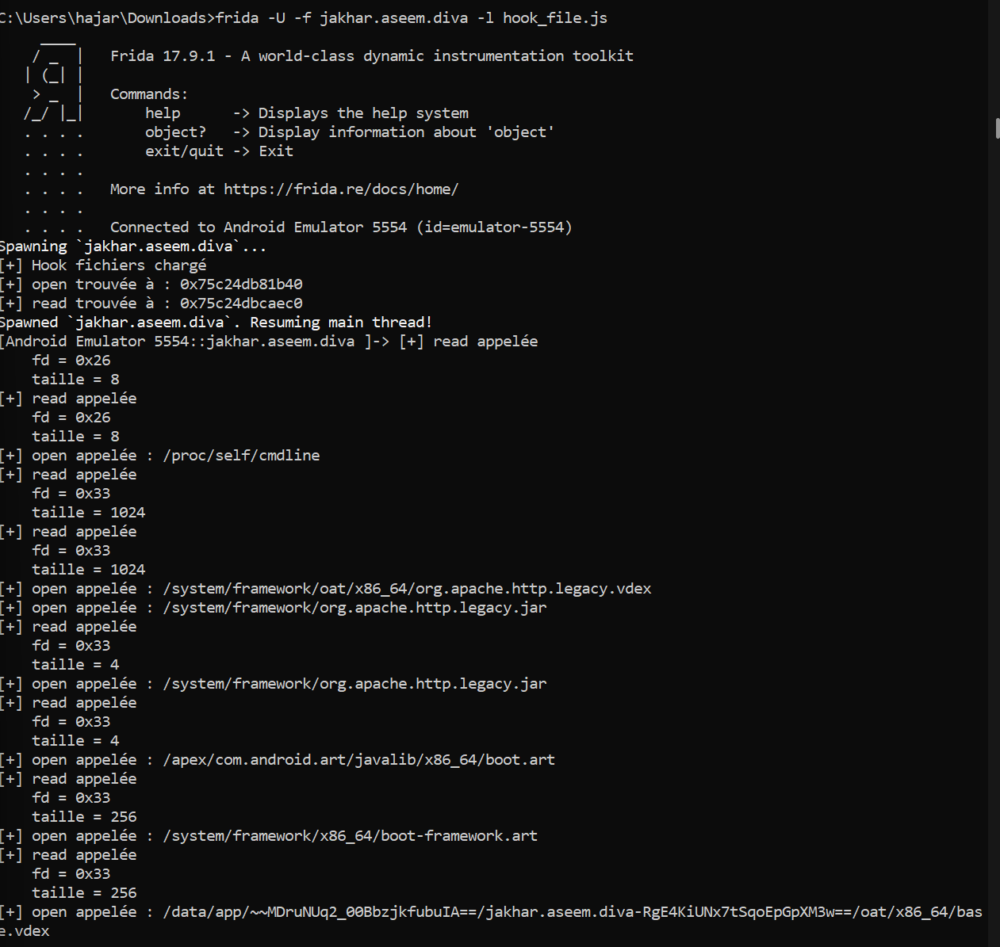 </p>


#### Analyse Détaillée des Fichiers Observés

| Fichier ouvert | Catégorie | Signification |
|---------------|-----------|--------------|
| `/proc/self/cmdline` | Système | L'app lit sa propre ligne de commande (métadonnées processus) |
| `/system/framework/*.vdex` | Runtime Android | Chargement des bibliothèques Java système (ART) |
| `/apex/com.android.art/javalib/*.art` | Runtime ART | Images de démarrage rapide du runtime |
| `/data/app/.../base.apk` | Application | Accès au package APK de DIVA lui-même |
| **`/data/user/0/jakhar.aseem.diva/databases/divanotes.db`** | **DIVA — Données** | **Base SQLite interne de l'application** |

> **Point critique :** L'ouverture de `divanotes.db` prouve que DIVA utilise une base SQLite locale pour stocker des données persistantes. Ce fichier sera notre cible dans l'étape 8.

---

## 11. Étape 8 — Hooking Java : SharedPreferences, SQLite, Debug

Cette étape exploite `Java.available = true` pour observer le comportement Java de DIVA.

### Vue d'Ensemble des Scripts Java

```
┌──────────────────────────────────────────────────────┐
│            ANALYSE JAVA — ÉTAPE 8                    │
├──────────────────┬───────────────────────────────────┤
│ hook_prefs.js    │ Lecture SharedPreferences          │
│ hook_prefs_      │ Écriture SharedPreferences         │
│   write.js       │ → clés : user, password           │
├──────────────────┼───────────────────────────────────┤
│ hook_sqlite.js   │ Requêtes SQL (CREATE, INSERT)      │
│                  │ → table myuser, données visibles   │
├──────────────────┼───────────────────────────────────┤
│ hook_debug.js    │ isDebuggerConnected()              │
│ hook_runtime.js  │ Runtime.exec() commandes système   │
│ hook_file_java.js│ java.io.File chemins manipulés     │
└──────────────────┴───────────────────────────────────┘
```

---

### 8.1 Vérification Java.available

Avant de lancer tout hook Java, on vérifie l'accès à la JVM :

```powershell
frida -U -f jakhar.aseem.diva
```
<p align="center"> 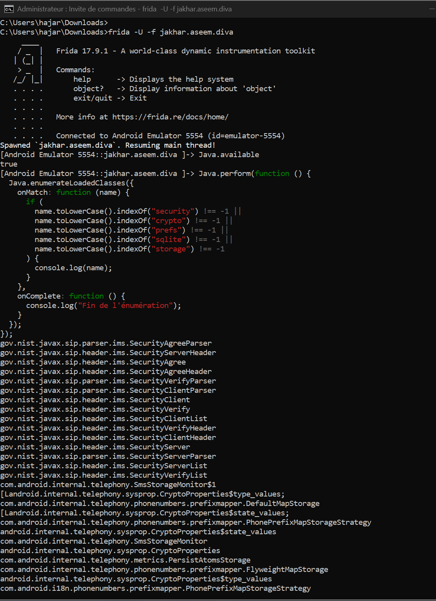 </p>

### 8.2 Recherche de Classes Java Sensibles

Dans la console Frida :

**Mots-clés recherchés :** `security`, `crypto`, `prefs`, `sqlite`, `storage`

**Interprétation :** Cette commande cartographie les classes Java sensibles chargées par DIVA, permettant d'identifier les zones d'intérêt pour une analyse approfondie.

---

### 8.3 Hook SharedPreferences — Lectures

#### Script : `hook_prefs.js`

<p align="center"> 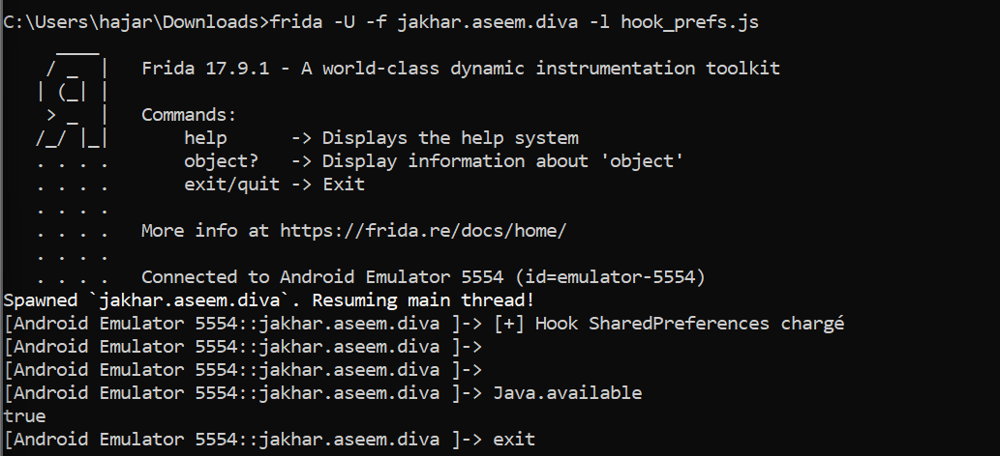 </p>

```powershell
frida -U -f jakhar.aseem.diva -l .\hook_prefs.js
```

**Résultat obtenu :** Aucun appel à `getString()` ou `getBoolean()` pendant les interactions testées.

**Interprétation :** Le hook est correctement injecté (Java.available = true), mais `DIVA` n'effectue pas de lecture de SharedPreferences par ces méthodes dans les scénarios testés, ou utilise d'autres chemins d'accès.

---

### 8.4 Hook SharedPreferences — Écritures 

#### Script : `hook_prefs_write.js`

<p align="center"> 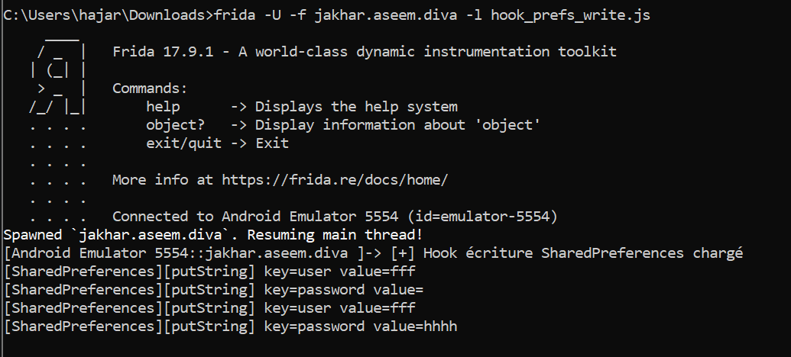 </p>

```powershell
frida -U -f jakhar.aseem.diva -l .\hook_prefs_write.js
```
<p align="center"> 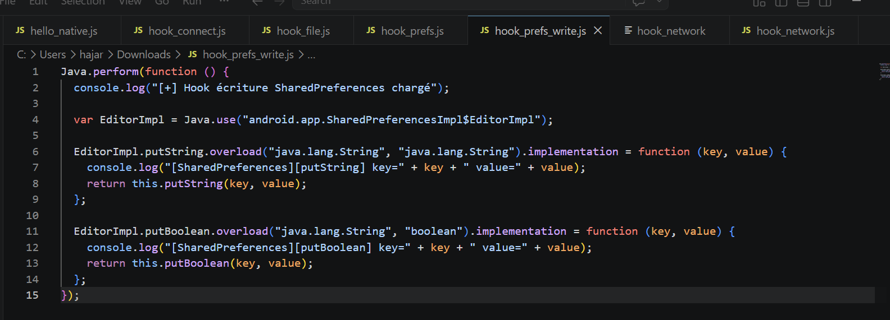 </p>

#### Interprétation Détaillée

| Ligne observée | Signification |
|---------------|--------------|
| `key=user value=fff` | DIVA écrit un nom d'utilisateur en clair dans SharedPreferences |
| `key=password value=` | Un mot de passe vide est d'abord enregistré |
| `key=password value=hhhh` | Puis un autre mot de passe est stocké (en clair) |

> **Vulnérabilité identifiée :** Les informations d'authentification (`user`, `password`) sont stockées **en clair** dans SharedPreferences. Sur un appareil rooté ou analysé, ces données sont directement lisibles.

---

### 8.5 Hook SQLite — Requêtes SQL ⭐

```powershell
frida -U -f jakhar.aseem.diva -l .\hook_sqlite.js
```
<p align="center"> 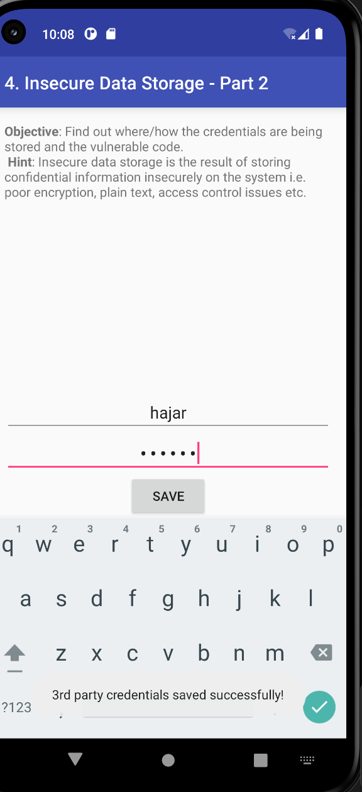 </p>

Action effectuée dans DIVA : Navigation vers **INSECURE DATA STORAGE PART 1**, saisie de données utilisateur.

#### Résultat Obtenu ⭐
<p align="center"> 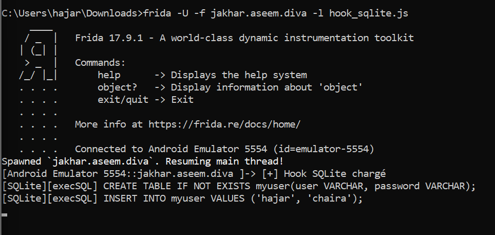 </p>


#### Interprétation Détaillée

```sql
-- Requête 1 : Création de la table
CREATE TABLE IF NOT EXISTS myuser(user VARCHAR, password VARCHAR);
```

| Élément | Analyse |
|---------|---------|
| Table `myuser` | Table dédiée au stockage des utilisateurs |
| `user VARCHAR` | Colonne nom d'utilisateur — type texte |
| `password VARCHAR` | Colonne mot de passe — **type texte, sans chiffrement** |

```sql
-- Requête 2 : Insertion de données
INSERT INTO myuser VALUES ('hajar', 'chaira');
```

| Élément | Analyse |
|---------|---------|
| Valeur `user` | `hajar` — visiblement interceptée |
| Valeur `password` | `chaira` — **stockée en clair dans SQLite** |

> **Vulnérabilité critique :** Le mot de passe est stocké **en clair dans une base SQLite**. La base `divanotes.db` est accessible depuis le stockage interne sur un appareil rooté ou via ADB.

La **corrélation entre le hook natif (open)** et le **hook Java (SQLite)** confirme que c'est bien `divanotes.db` qui stocke ces données structurées.

---

### 8.6 Hook Debug — Vérifications Anti-Debug

#### Script : `hook_debug.js`
<p align="center"> 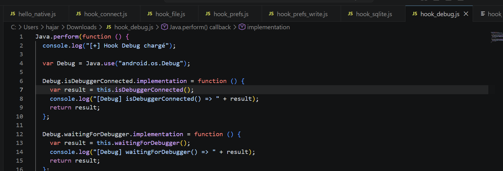 </p>

```powershell
frida -U -f jakhar.aseem.diva -l .\hook_debug.js
```

**Résultat obtenu :**

<p align="center"> 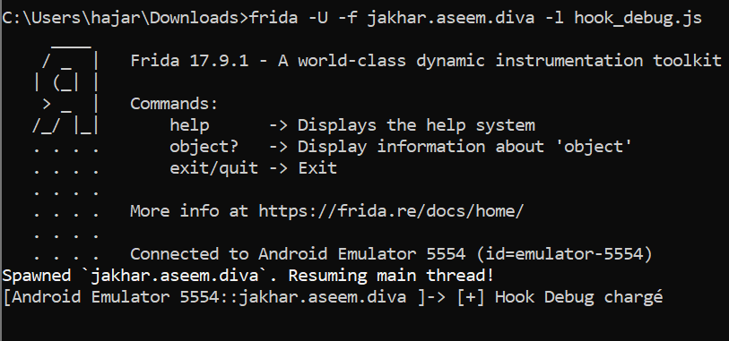 </p>


**Interprétation :** DIVA ne fait pas appel à `isDebuggerConnected()` ni à `waitingForDebugger()` dans les scénarios testés. Cela indique l'absence de mécanismes anti-debug Java explicites dans cette version de l'application.

---

### 8.7 Hook Runtime.exec — Commandes Système

<p align="center"> 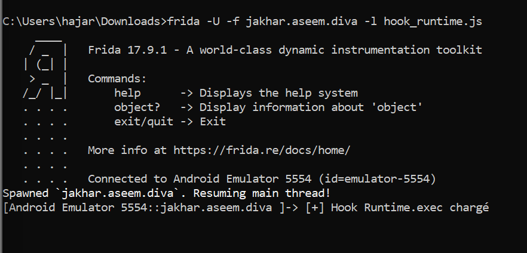 </p>

```powershell
frida -U -f jakhar.aseem.diva -l .\hook_runtime.js
```

**Résultat obtenu :**

```
[+] Hook Runtime.exec chargé
```

**Interprétation :** DIVA n'exécute pas de commandes système via `Runtime.exec()` dans les actions testées. L'application ne semble pas interagir avec l'environnement système de cette manière.

---

### 8.8 Hook File Java — Chemins de Fichiers

<p align="center"> 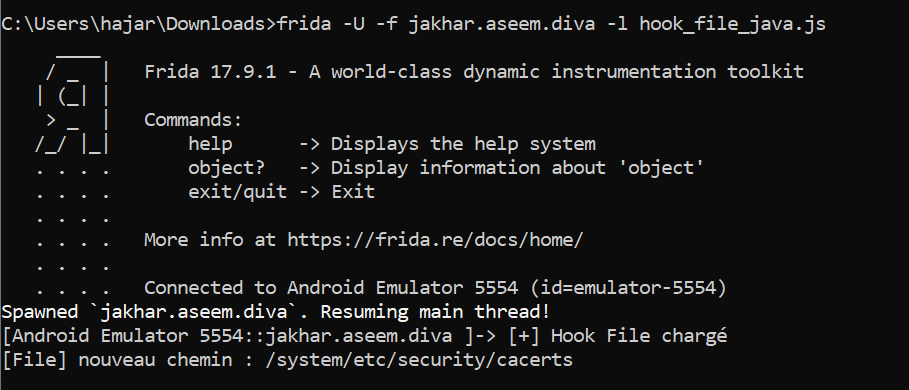 </p>

```powershell
frida -U -f jakhar.aseem.diva -l .\hook_file_java.js
```

**Résultat attendu :**

```
[+] Hook File chargé
[File] nouveau chemin : /data/user/0/jakhar.aseem.diva/...
[File] nouveau chemin : /data/data/jakhar.aseem.diva/databases/...
```

**Interprétation :** Ce hook complète le hook natif `open()` en capturant les chemins manipulés côté Java, permettant d'identifier les zones de stockage utilisées par le code applicatif.

---

## 12. Synthèse et Interprétation Sécurité

### Tableau Récapitulatif de Tous les Scripts

| Script | Cible | Résultat obtenu | Statut |
|--------|-------|----------------|--------|
| `hello.js` | Validation Java | `[+] Frida Java.perform OK` |  Succès |
| `hello_native.js` | Validation native | `recv appelée` |  Succès |
| `hook_connect.js` | Réseau — connect | `fd=0x30, retour=0` |  Connexion réseau détectée |
| `hook_network.js` | Réseau — send/recv | `send/recv appelées` |  Trafic réseau intercepté |
| `hook_file.js` | Fichiers natifs | `divanotes.db` ouvert |  BDD locale identifiée |
| `hook_prefs.js` | SharedPrefs lecture | Aucune lecture |  Non utilisé (normal) |
| `hook_prefs_write.js` | SharedPrefs écriture | `key=user, key=password` |  Données en clair |
| `hook_sqlite.js` | Requêtes SQL | `CREATE TABLE + INSERT` |  Stockage en clair |
| `hook_debug.js` | Anti-debug | Aucune vérification |  Pas de protection |
| `hook_runtime.js` | Commandes système | Aucune commande | Pas de shell |
| `hook_file_java.js` | Chemins Java | Chemins de stockage |  Zones identifiées |

### Vulnerabilités Identifiées dans DIVA

```
┌──────────────────────────────────────────────────────────────────┐
│              ANALYSE DE SÉCURITÉ — RÉSULTATS FINAUX              │
├──────────────────────────────────────────────────────────────────┤
│                                                                  │
│  1. VULNÉRABILITÉ CRITIQUE — STOCKAGE SQL EN CLAIR              │
│     ┌─────────────────────────────────────────────────────┐     │
│     │ Table : myuser                                      │     │
│     │ Colonnes : user VARCHAR, password VARCHAR           │     │
│     │ Données : INSERT INTO myuser VALUES('hajar','chaira')│    │
│     │ Fichier : /data/.../databases/divanotes.db          │     │
│     └─────────────────────────────────────────────────────┘     │
│     Impact : mot de passe lisible par toute app rootée          │
│                                                                  │
│  2. VULNÉRABILITÉ HAUTE — SHAREDPREFS EN CLAIR                  │
│     ┌─────────────────────────────────────────────────────┐     │
│     │ key=user     value=fff                              │     │
│     │ key=password value=hhhh                             │     │
│     └─────────────────────────────────────────────────────┘     │
│     Impact : identifiants accessibles via fichier XML prefs      │
│                                                                  │
│  3. INFORMATION — RÉSEAU ACTIF                                   │
│     ┌─────────────────────────────────────────────────────┐     │
│     │ connect() → fd=0x30, retour=0                       │     │
│     │ send() / recv() → échanges détectés                 │     │
│     └─────────────────────────────────────────────────────┘     │
│     Impact : communications réseau non chiffrées potentielles    │
│                                                                  │
│  4. POSITIF — ABSENCE DE PROTECTION ANTI-DEBUG                  │
│     → isDebuggerConnected() jamais appelé                        │
│     → Runtime.exec() jamais utilisé                              │
│     Impact : analyse dynamique facilitée (pas de protection)     │
│                                                                  │
└──────────────────────────────────────────────────────────────────┘
```

### Résumé Réponses aux Objectifs du Lab

| Question du Lab | Réponse obtenue |
|----------------|----------------|
| L'app utilise-t-elle le réseau ? | **Oui** — `connect()` détectée, `send/recv` actifs |
| L'app lit-elle des fichiers locaux ? | **Oui** — `divanotes.db`, `base.apk`, fichiers système |
| L'app utilise-t-elle du chiffrement ? | **Non** — données stockées en clair (SQLite, SharedPrefs) |
| Quelles classes sensibles existent ? | `SQLiteDatabase`, `SharedPreferencesImpl`, `EditorImpl` |
| Y a-t-il des protections anti-debug ? | **Non** — aucun appel à `isDebuggerConnected()` |

---

### Tableau des Bonnes Pratiques OWASP Mobile

| Risque OWASP | Constaté dans DIVA | Correction |
|-------------|-------------------|-----------|
| M2 - Insecure Data Storage | Oui — SQLite + SharedPrefs en clair | EncryptedSharedPreferences + SQLCipher |
| M3 - Insecure Communication | Potentiel — trafic réseau non chiffré | TLS 1.3 + Certificate Pinning |
| M9 - Reverse Engineering | Aucune protection | Obfuscation ProGuard + anti-debug |
| M10 - Extraneous Functionality | Logs de debug | Désactiver logs en production |

---


